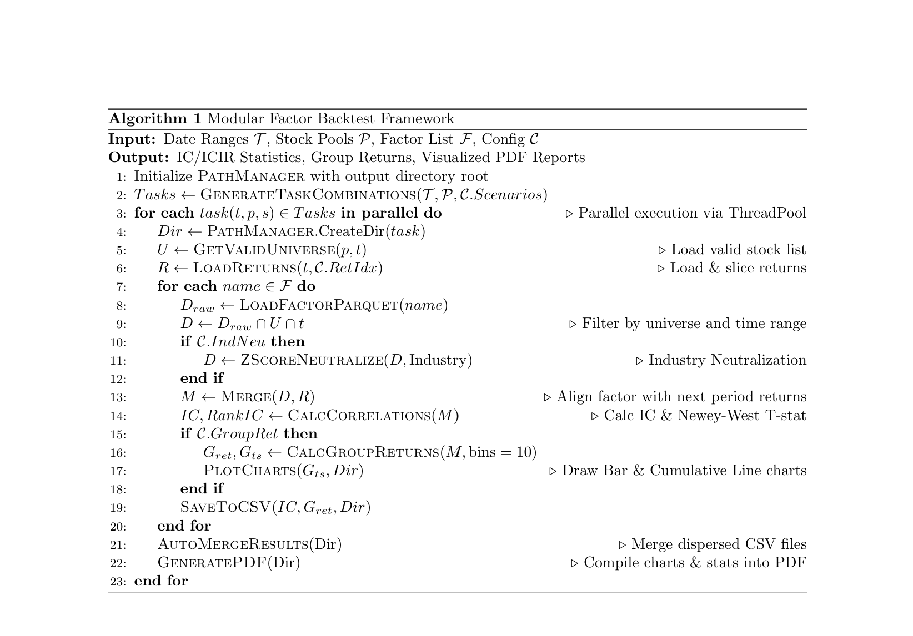

[简体中文](./README(CH).md) | English

# 📈 FactorTestProject - Modular Quantitative Factor Backtesting Framework

**FactorTestProject** is a lightweight, high-performance quantitative factor backtesting framework developed in Python. Designed for quantitative researchers and beginners alike, it aims to provide a one-stop solution covering **data cleaning**, **factor calculation**, **IC/ICIR analysis**, and **visualized report generation**.

The project adopts a clear modular engineering design, supports multi-threaded parallel computation, and features memory and I/O optimizations for large-scale Pandas operations.

-----

## ✨ Core Features

* **⚡ High-Performance Backtesting**: Deeply optimized for `groupby` and `merge` operations, supporting efficient computation for massive factor datasets.
* **🧩 Modular Architecture**: Complete separation of configuration, data, calculation, and reporting layers. The code logic is clear, extensible, and easy to maintain.
* **📊 Automated Research Reports**: One-click generation of PDF research reports including IC time-series plots, grouped cumulative return charts, and long-short net value curves.
* **🛠 Custom Factors**: Supports reading external custom factor files in Parquet/CSV formats without dependency on specific database environments.
* **🗂 Intelligent Path Management**: Built-in `PathManager` automatically plans output directories based on backtest parameters, eliminating file clutter.
* **🚀 Parallel Acceleration**: Supports multi-threaded concurrent testing for different start dates, stock pools, or abnormal scenarios.

-----

## 📂 Project Directory Structure

~~~text
FactorTestProject/
│
├── config/
│   ├── __init__.py
│   └── settings.py          # [Console] Global parameter configuration (dates, stock pools, factor paths, etc.)
│
├── core/
│   ├── __init__.py
│   ├── data_engine.py       # [Data Layer] Database interaction, data cleaning, Parquet partitioning
│   ├── calculator.py        # [Calculation Layer] Core backtest logic (IC calc, Newey-West adjustment, group returns)
│   └── reporter.py          # [Presentation Layer] Matplotlib plotting engine and ReportLab PDF generator
│
├── utils/
│   ├── __init__.py
│   ├── helpers.py           # [Toolbox] General utility functions
│   └── path_manager.py      # [Steward] Unified management of file path naming and directory creation
│
├── results/                 # [Output] Backtest results are automatically saved here (categorized by task)
│
├── main.py                  # [Entry] Main entry point for the program, handles task scheduling
└── requirements.txt         # List of project dependencies
~~~

-----

## 🧮 Core Algorithms and Mathematical Principles

This framework implements standard single-factor testing indicators in `core/calculator.py`. Below are the mathematical details behind the backtesting logic:

### 1. IC (Information Coefficient)

IC is used to measure the linear correlation between factor values and next-period returns, reflecting the predictive power of the factor.

* **Normal IC (Pearson)**:
  $$IC_t = \frac{\text{Cov}(F_t, R_{t+1})}{\sigma_{F_t} \sigma_{R_{t+1}}}$$
  Where $F_t$ is the factor value at time $t$, and $R_{t+1}$ is the stock return at time $t+1$.

* **Rank IC (Spearman)**: If `RANKIC = True` is configured, factor values and returns are first ranked (converted to ranks) before calculating the correlation coefficient. This eliminates the influence of outliers and captures non-linear relationships.
  $$\text{RankIC}_t = 1 - \frac{6 \sum d_i^2}{n(n^2 - 1)}$$
  *(Where $d_i$ is the difference between the factor rank and return rank of an individual stock, and $n$ is the number of stocks in the cross-section)*.

### 2. ICIR (Information Ratio)

Measures the stability of the IC, representing the factor's predictive ability per unit of risk.

$$ICIR = \frac{\overline{IC}}{\sigma_{IC}} \times \sqrt{N}$$

* $\overline{IC}$: The time-series mean of the IC sequence.
* $\sigma_{IC}$: The time-series standard deviation of the IC sequence.
* *(Note: The ICIR output by this framework is usually the raw ratio before annualization; it can be multiplied by $\sqrt{252}$ if necessary).*

### 3. Turnover Proxy

This project uses **factor autocorrelation** to estimate the turnover rate of the factor. The more stable the factor (higher autocorrelation), the lower the portfolio turnover.

$$\text{AutoCorr}_t = \text{RankCorr}(F_t, F_{t-1})$$
$$\text{Turnover} \approx \frac{1 - \overline{\text{AutoCorr}}}{2}$$

* **Interpretation**: If the factor ranking remains completely unchanged ($\text{AutoCorr}=1$), the theoretical turnover is 0; if the factor ranking is completely random ($\text{AutoCorr} \approx 0$), the theoretical turnover is approximately 50%.

### 4. Significance Testing (Newey-West T-statistic)

Since IC sequences typically exhibit **autocorrelation** and **heteroscedasticity**, standard T-tests may overestimate significance. This project adopts the **Newey-West HAC (Heteroscedasticity and Autocorrelation Consistent)** adjustment to calculate more robust T-statistics.

$$t_{NW} = \frac{\overline{IC}}{\hat{\sigma}_{HAC}}$$

* **Lag Selection**:
  The code automatically calculates the optimal lag order $L$ based on the sample size $T$:
  
  $$L = \text{int}\left(4 \times \left(\frac{T}{100}\right)^{\frac{2}{9}}\right)$$

### 5. Group Return

On a daily basis, the stock pool is divided into 10 groups based on factor values (from largest to smallest, where G1 has the smallest factor values and G10 has the largest).

$$R_{g,t} = \frac{1}{N_g} \sum_{i \in Group_g} R_{i, t+1}$$

* **Long-Short Return**: $R_{G10} - R_{G1}$
* **Excess Return**: If specific market scenarios are set (e.g., `ABN_DATES_TEST = 'rise'`), the code automatically subtracts the daily market mean:
  $$R_{g,t}^{excess} = R_{g,t} - R_{market, t}$$

-----

## 🚀 Quick Start

### 1. Environment Preparation

Ensure Python 3.8+ is installed, and run the following in the project root directory:

~~~bash
pip install -r requirements.txt
~~~

### 2. Configure Backtest Parameters

Open `config/settings.py` and modify the parameters as needed. The file contains detailed comments. Core parameters include:

~~~python
# === Mode Selection ===
MODE = 'test'  # 'test': Run backtest; 'save': Extract data

# === Custom Factors ===
# If you have your own factor file (Parquet/CSV), enter the path here
FACTOR_ADD_PATH = r"./MyFactorData.parquet"
CUSTOM_FACTOR_NAME = 'MyAlpha01'

# === Backtest Parameters ===
START_DATES = ['2021-01-01']  # Start dates
END_DATE = '2025-06-30'       # End date
STOCK_POOLS = ['all']         # Stock pools: 'all', '300', '500', 'HighBeta1000'
RET_IDX = 'Open5TWAP'         # Return calculation: 'Open5TWAP' (Open avg price) or 'ClosePrice'
GROUP_RET = True              # Whether to calculate group returns
RANKIC = True                 # Whether to use RankIC
~~~

### 3. Run Backtest

~~~bash
python main.py
~~~

Program Execution Flow:

1. **Data Preprocessing**: Automatically reads the custom factor file, partitions it by year, and stores it in Parquet format under the `data/` directory.
2. **Parallel Computation**: Based on the configured dates and stock pools, calculates ICIR and group returns in parallel.
3. **Report Generation**: Automatically generates charts and compiles the PDF.

-----

## 📊 Output Results Description

Upon completion, results will be saved in the `results/` directory with the folder naming format:
`Start{StartDate}_Pool{StockPool}_{Scenario}`

**The folder includes:**

| Filename/Folder | Description |
| :--- | :--- |
| `figures/` | Stores all generated PNG images (group return bar charts, cumulative net value curves) |
| `ICIR_... .csv` | Overall statistical indicators of the factor (Mean IC, ICIR, Turnover, t-stat, etc.) |
| `GroupRet_... .csv` | Average return statistics for the 10 groups |
| `GroupRet_ts_... .csv` | Daily time-series data of group returns (used for plotting) |
| `IC_ts_... .csv` | Daily time-series data of IC values |
| **`Merged_..._Combined.pdf`** | **Final Summary Report**, containing all statistics and charts |

-----

## ⚙️ Advanced Features

### 1. Industry Neutralization

Set `IND_NEU = True` in `settings.py`.

* **Logic**: Before calculating IC and grouping, factor values are Z-Score standardized within Shenwan Level 1 (SW1) industries, and outliers beyond 3 standard deviations are removed.
* **Formula**: $F_{neutral} = \frac{F_{raw} - \mu_{ind}}{\sigma_{ind}}$

### 2. Abnormal Scenario Testing

Set `ABN_DATES_TEST` in `settings.py`.

* `'rise'`: Tests only historical periods where the market surged.
* `'V'`: Tests only historical periods where the market underwent a "V-shaped" reversal.
* `['path/to/dates.csv']`: Pass a custom file containing a list of dates to test only on those specific days.

### 3. Custom Stock Pools

In addition to the built-in `300/500/800` pools, you can provide a CSV file path containing `TradingDay`, `SecuCode`, and `Weight` to the `STOCK_POOLS` parameter; the framework will automatically load it as a stock pool.

## 🧬 Algorithm Flow

-----

## 🤝 Contribution

Issues and Pull Requests are welcome!
If you find this project helpful, please give it a ⭐️ Star!
